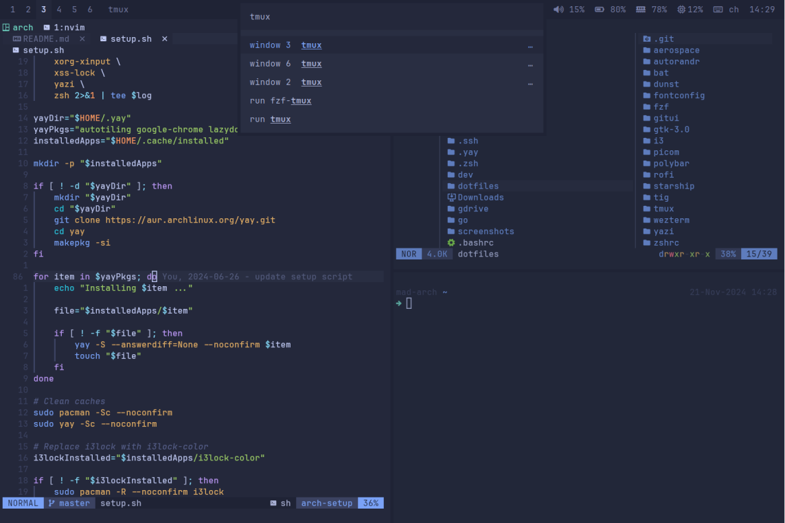

# Marc's Arch Setup

This is a simple setup script that helps with installing applications, [dotfiles](https://github.com/marcantondahmen/dotfiles) and a Neovim [configuration](https://github.com/marcantondahmen/nvim-config) to a fresh [Arch-Linux](https://archlinux.org/) machine in order to replicate a productive development environment based on [i3wm](https://i3wm.org/), [tmux](https://github.com/tmux/tmux) and other minimalistic terminal apps.



> [!IMPORTANT]
> Please note that this is my personal setup script for my work machine. It helps to quickly replicate my development environment for my day job. Since your needs might differ, simply feel free to fork this repository and make it fully yours.

---

<!-- vim-markdown-toc GFM -->

- [Installation](#installation)
  - [1. Installing Arch](#1-installing-arch)
  - [2. On First Boot](#2-on-first-boot)
  - [3. Installing Packages and Dotfiles](#3-installing-packages-and-dotfiles)
- [Package and Kernel Updates](#package-and-kernel-updates)
- [Fixing a Broken Installation](#fixing-a-broken-installation)
- [LTS Kernel](#lts-kernel)
- [Optional Steps](#optional-steps)
  - [SSH Agent](#ssh-agent)
  - [Authenticate to GitHub](#authenticate-to-github)
  - [Monitor Setup](#monitor-setup)
    - [Example Dual-Monitor Setup](#example-dual-monitor-setup)
  - [Startup Font Size for Encrypted Volumes](#startup-font-size-for-encrypted-volumes)
  - [Cursor Size](#cursor-size)
  - [Bluetooth](#bluetooth)
  - [Connect Google Drive](#connect-google-drive)
  - [Device Specific Issues](#device-specific-issues)
    - [Surface Laptops](#surface-laptops)
      - [Thermald Setup](#thermald-setup)

<!-- vim-markdown-toc -->

## Installation

The installation process can be divided into three main steps.

### 1. Installing Arch

This setup assumes that a bootable USB drive with the Arch ISO was already created. Arch-Linux will be installed using the `archinstall` command. A working internet connection is required during installation and can be established using an iPhone hotspot via USB.

During the installation process choose the following configuration:

1. Bootloader: Systemd Boot
2. Environment: `i3wm` with the `lightdm-slick-greeter`.
3. Network configuration: [NetworkManager](https://wiki.archlinux.org/title/NetworkManager) (default backend)
4. Additional packages:
   - base-devel
   - bash
   - broadcom-wl (for macs)
   - curl
   - firefox
   - git
   - vim (just in case)

When the installation has finished, remove th USB drive and boot into the fresh installation.

### 2. On First Boot

After running `archinstall` successfully and booting the first time into the fresh installation, the following steps are required in order to set up a readable terminal and connect to WiFi.

1. Open the default `xterm` terminal with `alt+enter`. Optionally start a new terminal window from there with a larger font size using

   ```bash
   xterm -fa 'Monospace' -fs 24 &
   ```

2. Start the NetworkManager:

   ```bash
   sudo systemctl start NetworkManager
   ```

3. Connect to a WiFi:

   ```bash
   nmcli device wifi list
   nmcli device wifi connect [SSID] password [PASSWORD]
   ```

### 3. Installing Packages and Dotfiles

Now, install all packages, dotfiles and Neovim configuration.

1. Download and run the setup script:

   ```bash
   curl -OL https://raw.githubusercontent.com/marcantondahmen/arch-setup/master/setup.sh
   bash setup.sh
   ```

2. Open Neovim and run `PackerSync`. It is possible that Neovim has to be restarted multiple time in order to complete the setup.
3. Reboot the machine.

> [!NOTE]
> Pacman logs can be found in `~/.arch-setup-logs`.

## Package and Kernel Updates

This script can be also used to update all packages.

```bash
bash setup.sh
```

> [!NOTE]
> Note that **the kernel is excluded** from system updates. In order to run a full update including kernel updates, run:

```bash
sudo pacman -Syu

cd ~/.yay/yay
git pull
makepkg -si
yay -Syu
```

You can confirm the latest kernel version by running after a reboot:

```bash
uname -r
```

## Fixing a Broken Installation

In order to `chroot` into a broken installation with an encrypted drive (LVM on LUKS) follow the steps below. This guide assumes that the root partition is on `/dev/sda2` while the boot partition is on `/dev/sda1`.

1. Open container:

   ```bash
   cryptsetup open /dev/sda2 cryptroot
   ```

2. Activate LVM volume:

   ```bash
   vgscan
   vgchange -ay
   ```

3. Mount volumes (mkdir mountpoints if needed):

   ```bash
   mount -t btrfs -o subvol=@ /dev/mapper/[VGNAME-root] /mnt
   mount -t btrfs -o subvol=@home /dev/mapper/[VGNAME-root] /mnt/home
   mount -t btrfs -o subvol=@log /dev/mapper/[VGNAME-root] /mnt/log
   mount -t btrfs -o subvol=@pkg /dev/mapper/[VGNAME-root] /mnt/pkg
   mount /sda1 /mnt/boot
   ```

4. Chroot into system

   ```bash
   arch-chroot /mnt
   ```

5. Do whatever is required to fix the installation like:

   ```bash
   pacman -Syu
   pacman -S linux
   bootctl update
   mkinitcpio -P
   ```

6. In order to exit the session run:

   ```bash
   exit
   umount -R /mnt
   reboot
   ```

## LTS Kernel

It is recommended to also install the `linux-lts` kernel as fallback. The LTS kernel can be added as follows:

1. Install the following packages:

   ```bash
   sudo pacman -S linux-headers linux-lts linux-lts-headers dkms
   ```

   Also install the DKMS wifi driver in case you use an older Macbook:

   ```bash
   sudo pacman -S broadcom-wl-dkms
   ```

   Confirm replacing the driver when being asked.

2. Create a bootloader entry:

   ```bash
   cd /boot/loader/entries/
   sudo cp [date]_linux.conf [date]_linux-lts.conf
   sudo vim [date]_linux-lts.conf
   ```

   Then edit the `title`, `linux` and `initrd` values.

   ```bash
   title   Arch Linux LTS (linux-lts)
   linux   /vmlinuz-linux-lts
   initrd  /initramfs-linux-lts.img
   options ...
   ```

3. Optionally set the default kernel in the boot menu in `/boot/loader/loader.conf`:

   ```bash
   default [date]_linux-lts.conf
   ```

4. Reboot and verify using `uname -r`.

## Optional Steps

The following steps are optional and might also depend on the machine Arch-Linux is running on.

### SSH Agent

This setup ships with a fully configured SSH Agent that also stores passphrases of keys in the `gnome-keyring`.

### Authenticate to GitHub

This setup ships with the _GitHub CLI_. It can be used to authenticate your machine to GitHub running:

```bash
gh auth login
```

### Monitor Setup

You can easily store and switch between multiple display profiles with [autorandr](https://github.com/phillipberndt/autorandr). Monitor configuration can be changed using `xrandr`.

In order to save the currently used setup, run:

```bash
autorandr --save somename
```

You can run the following command to automatically load the current setup:

```bash
autorandr --change
```

#### Example Dual-Monitor Setup

Setting up a dual-monitor configuration where a laptop has _sometimes_ a secondary screen attached can be realized as follows:

1. First, only the laptop: Disconnect all other screens and run `xrandr` to configure the built-in screen. For example:

   ```bash
   xrandr --output eDP-1 --auto --scale 0.675
   ```

2. Save the _mobile_ config as follows:

   ```bash
   autorandr --save mobile
   ```

3. Reboot, just in case.

4. Attach the secondary screen configure both displays using `xrandr` as follows:

   ```bash
   xrandr --output eDP-1 --auto --scale 0.675
   xrandr --output DP-2 --auto --scale 1 --right-of eDP-1 --primary
   ```

   In case there is an error showing up when running the commands above, the actual framebuffer might be too small. This can happen when connecting an external monitor using a DisplayPort cable. In such a case, the framebuffer has to be set using the `--fb` argument:

   ```bash
   xrandr --fb 4816x1504 \
     --output eDP-1 --mode 2256x1504 --pos 0x0 \
     --output DP-2-6-6 --mode 2560x1440 --pos 2256x0 --primary
   ```

   Note that in this step the Laptop screen is configured as well!

5. Save the _home office_ configuration:

   ```bash
   autorandr --save home
   ```

Now changes of the connected monitors should be detected correctly.

### Startup Font Size for Encrypted Volumes

On a high-dpi laptop, the font size will be quite small when entering the passphrase for encrypted drives. Follow these steps in order to use another font:

1. Edit `/etc/vconsole.conf` and add or change:

   ```bash
   FONT=ter-v32n
   ```

2. Rebuild the initramfs:

   ```bash
   sudo mkinitcpio -P
   ```

3. Reboot

### Cursor Size

It also might be needed to set a correct size for the cursor. The cursor size can be defined by adding the following line to `~/.Xresources`:

```bash
Xcursor.size: 10
```

Then load the `.Xresources` in your `~/.xprofile`:

```bash
xrdb -merge ~/.Xresources
```

### Bluetooth

The bluetooth utility `bluetoothctl` is included in this setup. You can follow [this guide](https://wiki.archlinux.org/title/Bluetooth#Pairing) in order to pair your devices.

### Connect Google Drive

You can use [Rclone](https://rclone.org/) in order to connect and mount a _Google Drive_. It is also pre-installed in this setup.

1. Configure Rclone:

   ```bash
   rclone config
   ```

   Note that you can authenticate using the browser and therefore all keys and token fields can be left empty.

2. Mount the drive:

   ```bash
   mkdir -p ~/gdrive
   rclone mount gdrive: ~/gdrive
   ```

3. Automatically mount on boot:

   ```bash
   (crontab -l 2>/dev/null; echo "@reboot rclone mount --daemon gdrive: $HOME/gdrive") | crontab -
   ```

### Device Specific Issues

Some laptops require some work in order to get them running properly. For example it might be required to use a specific patched kernel that matches your machine or modify the boot loader options.

#### Surface Laptops

In case you are using a surface laptop, the best is to install a kernel from the [linux-surface](https://github.com/linux-surface/linux-surface) project. This will most likely help to make things like sleep, shutdown and other issues work.

Also it could be that a lot of ACPI errors show up on shutdown and in `journalctl`. In such case adding the `acpi_osi` and `pci` kernel parameters to the boot loader options might fix those issues. For example if a Surface Laptop 5 is also running Windows 10 in parallel, the additional parameters would be `acpi_osi='Windows 2020' pci=hpiosize=0`.

1. [acpi_osi](https://forum.manjaro.org/t/how-to-choose-the-proper-acpi-kernel-argument/1405)
2. [pci](https://github.com/linux-surface/linux-surface/issues/1082#issuecomment-2241851384)

##### Thermald Setup

Generally, using `thermald` can help to keep your quite and cool. Since this step is entirely optional, the default setup doesn't include `thermald` out of the box. Follow these steps to install and configure the _thermald_ service.

1. Install `thermald`:

   ```bash
   sudo pacman -S thermald
   ```

2. Add a configuration file (`thermal-conf.xml`) to the `/etc/thermald/` directory. You find macthing configurations on the internet. One that can be used for Surface Laptops can be found [here](https://github.com/linux-surface/linux-surface/tree/master/contrib/thermald).

3. Enable service:

   ```bash
   sudo systemclt enable thermald.service
   sudo systemclt start thermald.service
   ```

---

&copy; 2024-2026 Marc Anton Dahmen, MIT license
