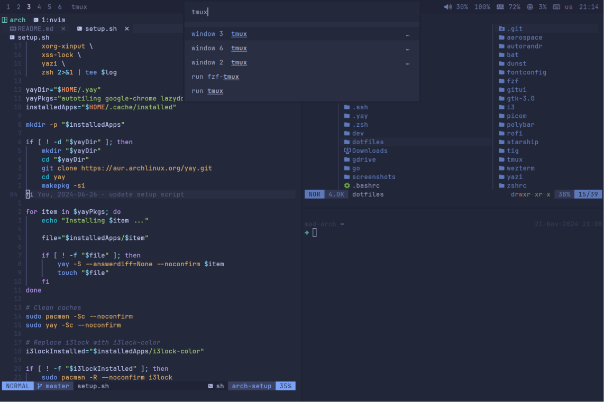

# Marc's Arch Setup

This is a simple setup script that helps with installing applications, [dotfiles](https://github.com/marcantondahmen/dotfiles) and a Neovim [configuration](https://github.com/marcantondahmen/nvim-config) to a fresh [Arch-Linux](https://archlinux.org/) machine in order to replicate a productive development environment based on [i3wm](https://i3wm.org/), [tmux](https://github.com/tmux/tmux) and other minimalistic terminal apps.



> [!IMPORTANT]
> Please note that this is my personal setup script for my work machine. It helps to quickly replicate my development environment for my day job. Since your needs might differ, simply feel free to fork this repository and make it fully yours.

---

<!-- vim-markdown-toc GFM -->

- [Preperations](#preperations)
- [Setup](#setup)
- [Package and Kernel Updates](#package-and-kernel-updates)
- [Optional Steps](#optional-steps)
  - [Authenticate to GitHub](#authenticate-to-github)
  - [Monitor Setup](#monitor-setup)
    - [Example Dual-Monitor Setup](#example-dual-monitor-setup)
  - [Cursor Size](#cursor-size)
  - [Bluetooth](#bluetooth)
  - [Connect Google Drive](#connect-google-drive)
  - [Device Specific Issues](#device-specific-issues)
    - [Surface Laptops](#surface-laptops)
  - [Thermald Setup](#thermald-setup)

<!-- vim-markdown-toc -->

## Preperations

This setup assumes that Arch-Linux is installed using the `archinstall` command. During the installation process it is required that _i3-wm_ is selected as the window manager when selecting the environment. Also make sure to select `LightDM/slick-greeter` as your greeter.

When the installation has finished, simply boot into the fresh installation, open the default terminal follow the steps below.

## Setup

The basic setup is quite straight forward and requires the following steps:

1. Download and run the setup script:

   ```bash
   curl -OL https://raw.githubusercontent.com/marcantondahmen/arch-setup/master/setup.sh
   bash setup.sh
   ```

2. Open Neovim and run `PackerSync`. It is possible that Neovim has to be restarted multiple time in order to complete the setup.
3. Reboot the machine.

> [!NOTE]
> Pacman logs can be found in `~/.arch-setup-logs`.

## Package and Kernel Updates

This script can be also used to update all packages. Note that **the kernel is excluded** from system updates. In order to run a full update including kernel updates, run:

```bash
sudo pacman -Syu
```

You can confirm the latest kernel version by running after a reboot:

```bash
uname -r
```

## Optional Steps

The following steps are optional and might also depend on the machine Arch-Linux is running on.

### Authenticate to GitHub

This setup ships with the _GitHub CLI_. It can be used to authenticate your machine to GitHub running:

```bash
gh auth login
```

### Monitor Setup

You can easily store and switch between multiple display profiles with [autorandr](https://github.com/phillipberndt/autorandr). Monitor configuration can be changed using `xrandr`.

In order to save the currently used setup, run:

```bash
autorandr --save somename
```

You can run the following command to automatically load the current setup:

```bash
autorandr --change
```

#### Example Dual-Monitor Setup

Setting up a dual-monitor configuration where a laptop has _sometimes_ a secondary screen attached can be realized as follows:

1. First, only the laptop: Disconnect all other screens and run `xrandr` to configure the built-in screen. For example:

   ```bash
   xrandr --output eDP-1 --auto --scale 0.675
   ```

2. Save the _mobile_ config as follows:

   ```bash
   autorandr --save mobile
   ```

3. Reboot, just in case.

4. Attach the secondary screen configure both displays using `xrandr` as follows:

   ```bash
   xrandr --output eDP-1 --auto --scale 0.675
   xrandr --output DP-2 --auto --scale 1 --right-of eDP-1 --primary
   ```

   Note that in this step the Laptop screen is configured as well!

5. Save the _home office_ configuration:

   ```bash
   autorandr --save home
   ```

Now changes of the connected monitors should be detected correctly.

### Cursor Size

It also might be needed to set a correct size for the cursor. The cursor size can be defined by adding the following line to `~/.Xresources`:

```bash
Xcursor.size: 10
```

Then load the `.Xresources` in your `~/.xprofile`:

```bash
xrdb -merge ~/.Xresources
```

### Bluetooth

The bluetooth utility `bluetoothctl` is included in this setup. You can follow [this guide](https://wiki.archlinux.org/title/Bluetooth#Pairing) in order to pair your devices.

### Connect Google Drive

You can use [Rclone](https://rclone.org/) in order to connect and mount a _Google Drive_. It is also pre-installed in this setup.

1. Configure Rclone:

   ```bash
   rclone config
   ```

   Note that you can authenticate using the browser and therefore all keys and token fields can be left empty.

2. Mount the drive:

   ```bash
   mkdir -p ~/gdrive
   rclone mount gdrive: ~/gdrive
   ```

3. Automatically mount on boot:

   ```bash
   (crontab -l 2>/dev/null; echo "@reboot rclone mount --daemon gdrive: $HOME/gdrive") | crontab -
   ```

### Device Specific Issues

Some laptops require some work in order to get them running properly. For example it might be required to use a specific patched kernel that matches your machine or modify the boot loader options.

#### Surface Laptops

In case you are using a surface laptop, the best is to install a kernel from the [linux-surface](https://github.com/linux-surface/linux-surface) project. This will most likely help to make things like sleep, shutdown and other issues work.

Also it could be that a lot of ACPI errors show up on shutdown and in `journalctl`. In such case adding the `acpi_osi` and `pci` kernel parameters to the boot loader options might fix those issues. For example if a Surface Laptop 5 is also running Windows 10 in parallel, the additional parameters would be `acpi_osi='Windows 2020' pci=hpiosize=0`.

1. [acpi_osi](https://forum.manjaro.org/t/how-to-choose-the-proper-acpi-kernel-argument/1405)
2. [pci](https://github.com/linux-surface/linux-surface/issues/1082#issuecomment-2241851384)

### Thermald Setup

Generally, using `thermald` can help to keep your quite and cool. Since this step is entirely optional, the default setup doesn't include `thermald` out of the box. Follow these steps to install and configure the _thermald_ service.

1. Install `thermald`:

   ```bash
   sudo pacman -S thermald
   ```

2. Add a configuration file (`thermal-conf.xml`) to the `/etc/thermald/` directory. You find macthing configurations on the internet. One that can be used for Surface Laptops can be found [here](https://github.com/linux-surface/linux-surface/tree/master/contrib/thermald).

3. Enable service:

   ```bash
   sudo systemclt enable thermald.service
   sudo systemclt start thermald.service
   ```

---

&copy; 2024 Marc Anton Dahmen, MIT license
